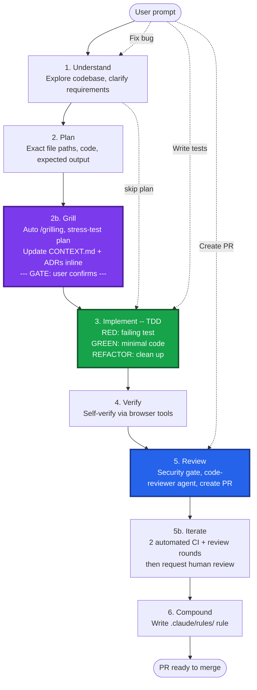
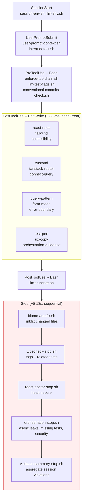

# Agent Skills

**Tell Claude what build. Get PR ready merge.**

Hooks enforce patterns real-time, skills guide workflow, orchestration layer ensure nothing ships without tests, accessibility, type safety, code review -- zero babysit.


## Install

Run inside [Claude Code](https://docs.anthropic.com/en/docs/claude-code) session (start with `claude` in terminal):

```bash
/plugin marketplace add malinskibeniamin/skills
```
```bash
/plugin install frontend-skills@skills
```
```bash
/reload-plugins
```

Three commands. Skills, hooks, agents activate immediately. Done.

**Recommended: rtk** (output-compression proxy, ~60-90% token savings on git/cargo/test/gh):

```bash
brew install rtk
rtk trust            # approve .rtk/filters.toml per project
```

Harness fail-open -- skip safe; SessionStart nudge remind if miss.

**Update** (pull latest):

```bash
/plugin install frontend-skills --force
```

Restart Claude Code session so hooks reload from new cache.

**Verify:**

```bash
bash "$(ls -d ~/.claude/plugins/cache/skills/frontend-skills/*/ | tail -1)scripts/verify-install.sh"
```

**Codex (OpenAI)** -- install as a Codex plugin from the repo's marketplace manifest:

```bash
brew upgrade --cask codex
codex features enable plugins
codex features enable hooks
codex plugin marketplace add malinskibeniamin/skills --ref v4.30.0
codex plugin marketplace upgrade skills
codex plugin add frontend-skills@skills
```

Track `main` instead of the pin with `--ref main`. Restart Codex after adding or upgrading so the Plugins UI reloads metadata.

**Fallback: individual skills via skills.sh** -- when you want specific skills instead of the full plugin:

```bash
bunx skills@latest add malinskibeniamin/skills/frontend-starter-kit --agent claude-code -y
bunx skills@latest add malinskibeniamin/skills/development-lifecycle --agent claude-code -y
bunx skills@latest add malinskibeniamin/skills/work-automation-kit --agent claude-code -y
```

Want proof and examples? Demo scripts, featured skill moments, and starter prompts live in [docs/DEMOS.md](docs/DEMOS.md); comparisons, measurement methodology, and common questions live in [docs/FAQ.md](docs/FAQ.md).

## How it all connects

```
You: "Build feature X" or "Fix these 5 issues overnight"
  │
  ├── Interactive ──-> Claude Code + /development-lifecycle
  │                    └── understand -> plan -> TDD -> verify -> review -> compound
  │
  └── Automated ───-> Routines (claude.ai/code/routines)
                      └── schedule, GitHub webhook, or API trigger
                          └── cloud session with hooks + CLAUDE.md active
                              └── PR review, triage, health checks, docs drift
```

### Development lifecycle

6-phase workflow drive every task, feature to fix. Phases skippable by task type -- bug fix jump straight to TDD, test request go direct Phase 3.



**Four layers, one outcome:**

| Layer | What | How | Reliability |
|---|---|---|---|
| **Skills** | What do | development-lifecycle (6 phases) | Loaded on demand |
| **Hooks** | Enforce quality | PostToolUse + Stop hooks, every edit | 100% automatic |
| **Agents** | Specialize | code-reviewer + verifier | Dispatched by skills |
| **Routines** | Automate | Cloud-hosted sessions on schedule/webhook/API | Unattended, 24/7 |

## Why this exists

| Problem | Without repo | With repo |
|---|---|---|
| Claude write `as any` | Ships to PR -> human catches -> feedback loop | Hook blocks immediately -> 50 tokens -> fixed |
| Claude skip tests | Ships -> human requests -> another round | Stop gate blocks -> tests added automatically |
| Claude use wrong patterns | 3-5 human review cycles per PR | 0-1 human review cycles per PR |
| Forget ask accessibility | No a11y until manual audit | Every component checked automatically |
| Must babysit every step | Manual: "now write tests", "now check types" | Full lifecycle runs without prompting |

**How works**: Hooks fire automatically, 100% reliable, zero LLM tokens. Skills add workflow guidance when need. Combo eliminate 80-90% human review cycles.

**vs. [obra/superpowers](https://github.com/obra/superpowers)**: Superpowers give great workflow skills (TDD, debug, plan). We take their best patterns AND add what they lack: **mechanical enforcement via hooks**. Superpowers teach Claude what do. We teach AND enforce -- if Claude forget, hook catch.

## When not to use this

Honest scoping -- this harness is **opinionated**. Here's when to skip it or fork it:

| Don't use if | Why |
|---|---|
| Backend-only repo (Go/Python/Rust) | React/TypeScript hooks add no value; fork the lifecycle skills only |
| Non-React frontend (Vue, Svelte, Angular) | ~80% of checks are React-specific |
| Throwaway prototype / spike | Stop gate blocks commits without tests; kills exploration velocity (set `ORCHESTRATION_STRICT=0` if keeping the plugin) |
| Can't use Bun | `enforce-toolchain.sh` bans npm/npx/yarn by default (configurable, but friction) |
| No Claude Code / Codex access | Hooks are harness-specific; nothing to enforce |
| Stack: not (TanStack Router + ConnectRPC + Protobuf v2) | Many setup skills assume this; fork to strip them |
| Team rejects opinionation | Setup skills pin choices (Biome over ESLint, TypeScript 7 `tsc` over preview-era `tsgo`, Vitest over Jest) |

**Partial adoption works.** Install `development-lifecycle` + `tdd` + `grilling` only to get workflow discipline without the stack-specific hooks.

## Skills catalog

Only remember one skill: `/development-lifecycle` (or alias `/work`). It covers the full flow. Everything else is optional -- reach for it when you need a specific capability.

| Category | What it covers | Representative skills |
|---|---|---|
| Workflow | Build, ship, review, debug | `/development-lifecycle`, `/go`, `/tdd`, `/swarm`, `/review` (`--deep` for release-blocking audits), `/triage`, `/diagnosing-bugs`, `/resolve-pr-feedback`, `/visual-review`, `/prime`, `/codex` |
| Kits | Bundles that install groups | `/frontend-starter-kit` (profiles: `full`, `minimal`, `redpanda`, per-tool), `/work-automation-kit`, `/codex-compat` |
| Guidance | Auto-load on matching files | `/accessibility`, `/tanstack-router`, `/connect-query`, `/e2e-testing`, `/registry-workflow`, `/ux-copy` |
| Infra | Slash-only setup | `/setup-routines` (cloud automation), `/setup-atlassian-workflow` (Jira via acli) |
| Agents | Dispatched by skills | `code-reviewer` (PR correctness, patterns, coverage), `verifier` (read-only independent verification) |

The generated authoritative catalog with every skill and its trigger lives in [ask-ben/SKILL.md](ask-ben/SKILL.md).

## How it works

Three layers automation run without manual invocation:

**Layer 1 -- Intent Detection** (every prompt, ~30ms): Detect what doing from prompt keywords, inject workflow directives. "Write test" -> TDD workflow. "Fix bug" -> triage pattern. "Create component" -> accessibility + design system checklist. "Create PR" -> CI verify + review.

**Layer 2 -- Pattern Enforcement** (every Edit/Write, ~293ms): PostToolUse hooks catch violations real-time. Claude see error, fix, hook re-check -- cycle repeat until clean. Plus file-aware guidance: write test file -> async leak tips, write component -> accessibility checklist.

**Layer 3 -- Quality Gate** (when Claude finish, <10s): Stop hooks verify work production-ready. Type check, lint autofix, health score, PLUS orchestration gate blocks on missing tests, async leaks, security issues. Claude no stop until PR ready merge.

**Auto-loading skills**: Skills with `paths:` frontmatter auto-load when Claude work on matching files. Write test -> TDD patterns load. Edit route -> TanStack Router patterns load. No `/skill-name` invocation needed.

Never see hook output directly. Claude just produce better code, with tests, accessible, secure, type-safe -- without asking each thing individually.

### Configuration

| Env var | Default | What does |
|---------|---------|--------------|
| `PROMPT_CONTEXT_LEVEL` | `standard` | How much state inject per prompt (`minimal`, `standard`, `full`) |
| `ORCHESTRATION_STRICT` | `1` | Set `0` during prototyping to disable "must have tests" gate |
| `REACT_COMPILER_MODE` | `infer` | Set `annotation` for brownfield codebases |
| `HOOK_VERBOSITY` | `normal` | `terse` = blocks only (suppress warns), `quiet` = all output suppressed |
| `HOOKS_FAIL_CLOSED` | `0` | Set `1` to block on hook script errors (catch misconfiguration) |

## Why hooks over skills over manual prompting

| Approach | Reliability | Token cost | Latency | Human effort |
|----------|-------------|------------|---------|--------------|
| Manual prompting | 0% (forgotten) | 0 extra | 0 | High (remember every rule) |
| Skills on-demand | ~70% (Claude may skip) | ~500 tokens/skill | ~0ms | Low |
| Skills with `paths:` | ~90% (auto-load on file match) | ~500 tokens/skill | ~0ms | None |
| PostToolUse hooks | 100% (always fires) | 0 (bash scripts) | ~293ms | None |
| UserPromptSubmit hooks | 100% (every prompt) | 0 (bash) + context | ~120ms | None |
| Stop hooks | 100% (every turn end) | 0 (bash) + test run | ~4-10s | None |

## Hook architecture

Hooks fire automatic at each stage of Claude Code session. PostToolUse hooks run concurrent for speed; Stop hooks run sequential as final quality gate.



The authoritative hook inventory (every lifecycle event and the scripts wired to it) lives in [skill-manifest.json](skill-manifest.json), the source of truth that generates the plugin hook configs. Non-JS/TS file edits (Go, Python, Markdown, and so on) get zero overhead -- all hooks exit immediately on non-matching file extensions.

## Toolchain enforcement

Bootstrap setup consolidated into **one skill** (4.27.0): `/frontend-starter-kit` with
profiles `full | minimal | redpanda | <tool>`. Each tool's install steps live in
`frontend-starter-kit/references/<tool>/` and load lazily -- toolchain (bun+TypeScript 7 `tsc`, destructive
command guards), biome (+Ultracite, auto-fix Stop hook), quality-gate, agent-config,
react-compiler, react-rules, zustand, env-validation (t3-env+zod), conventional-commits,
react-doctor, ci-pipeline, redpanda (registry workflow, `REDPANDA_KIT=1`).

Daily-work guidance formerly hidden behind `setup-` names is now directly model-invoked:
`/accessibility`, `/tanstack-router`, `/connect-query`, `/e2e-testing`, `/registry-workflow`,
`/ux-copy`. Optional infra stays slash-only: `/setup-routines` (cloud routines) and `/setup-atlassian-workflow` (Jira via acli).

```
bunx skills@latest add malinskibeniamin/skills/frontend-starter-kit --agent claude-code -y
```

## Codex compatibility

Codex = first-class harness. Supported equivalent hooks are mapped directly: SessionStart, UserPromptSubmit, PreToolUse, PostToolUse, Stop, plus Codex-only PermissionRequest through an adapter that reuses hard-deny Bash/MCP guardrails. Claude PostToolUseFailure maps to Codex PostToolUse because Codex post-tool hooks include failed Bash commands. Claude-only events without Codex equivalents (FileChanged, compact hooks, SessionEnd, Subagent hooks, WorktreeCreate) stay Claude-only until Codex adds matching lifecycle events. `AGENTS.md` at repo root replaces PostCompact context re-injection.

All hook paths use `$(git rev-parse --show-toplevel)` for resolution -- works from any CWD, silently skip in repos without hooks installed.

- **codex-compat** -- Install `.codex/hooks.json`, batch checker, `AGENTS.md`. Session state harness-agnostic (`CLAUDE_SESSION_ID` or `CODEX_SESSION_ID`).

  ```
  bunx skills@latest add malinskibeniamin/skills/codex-compat --agent claude-code -y
  ```

## Evals

Two layers testing prevent regressions:

**Script-level evals** -- verify hook scripts, file structure, content. Run locally in <5 seconds:

```
./evals/run.sh
```

**Agent-level evals** -- behavioral tests using [@vercel/agent-eval](https://github.com/vercel-labs/agent-eval) verify Claude Code actually follows rules when given adversarial prompts. Runs in Docker sandbox:

```
cd agent-evals && bun install --yarn && npx @vercel/agent-eval
```

Run only the adversarial AIP design review with `npx @vercel/agent-eval aip`.

## Credits and provenance

Everything this harness uses from [mattpocock/skills](https://github.com/mattpocock/skills) is vendored locally -- nothing needs installing from the upstream repo. Vendored: `ask-ben`, `tdd`, `triage`, `diagnosing-bugs`, `handoff`, `codebase-design` (improve-codebase-architecture absorbed into /improve architecture), `domain-modeling`, `grilling`, `prototype`, `research` (v1.1.0 rewrite, restored on owner request), `teach` (slash-only, kept on owner request), `to-spec`, `to-tickets`, `writing-great-skills`, `resolving-merge-conflicts`, `wayfinder`, `wizard`. Upstream skills judged dead, off-domain, or contradictory to this harness (obsidian-vault, scaffold-exercises, implement, loop-me, migrate-to-shoehorn, setup-pre-commit, git-guardrails-claude-code, edit-article) were removed in the 4.27.0 audit.

Several workflow skills are vendored from [Builder.io](https://www.builder.io) Agent-Native patterns (`/visual-plan`, `/visual-recap`, `/agent-watchdog`, `/plan-arbiter`, `/plow-ahead`, `/read-the-damn-docs`, `/efficient-frontier`) and from the Cursor Team Kit (`/what-did-i-get-done`).

Optional: TanStack packages ship their own reference skills via `npx @tanstack/intent@latest install` -- soft guidance only, no hooks. Lifecycle patterns (TDD red/green, grilling, writing-great-skills) are inspired by or vendored from [obra/superpowers](https://github.com/obra/superpowers); this harness adds mechanical enforcement on top.

## Security review: intentionally absent

Model-driven security review (per-edit security-audit hook, the review security hat, auth-path adversarial triggers) was removed by owner decision on 2026-07-10 after persistent false-positive flagging of legitimate cybersecurity work. Deterministic scanning (`/snyk-ux-security`, Biome) remains. Do not assume security coverage from this harness; restore from git history when model precision improves.
