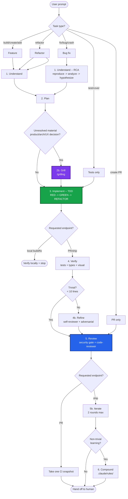
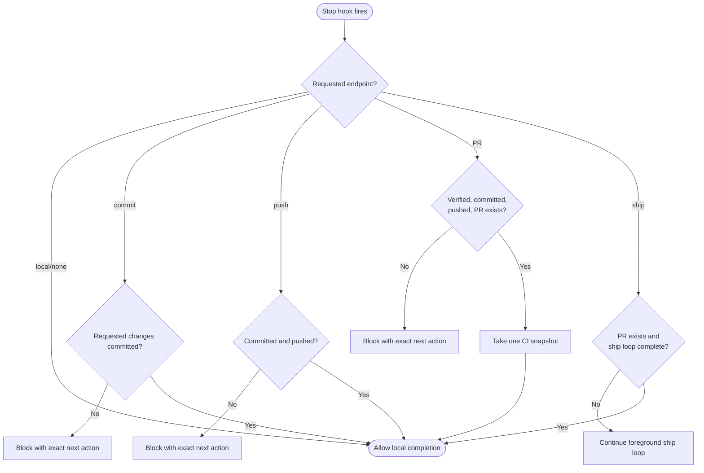

# Development Lifecycle Reference

> **Single-owner rule:** every axis below runs inline unless the user explicitly requests
> agents or invokes `/swarm`. `/work`, `/go`, `/review`, `/grilling`, and `/plow-ahead`
> are not delegation consent in either runtime.

## Phase Flowchart



## Phase 1: Understand

### New Feature
1. Read code, docs, recent git history
2. Clarifying Qs -- one at time
3. State one concise approach; offer 2-3 trade-offs only for an unresolved material decision
4. UI alternatives only when requested or visual direction is unresolved
5. Challenge approach (edge cases, failure modes)
6. Continue immediately when the request is well scoped; ask only when an unresolved material decision remains

### Research

Research inline:
- Alt libraries/patterns
- Prior art · conventions scan
- Edge cases · failure modes
- Open issues · dep gotchas

Background research requires explicit delegation.

### Monitor Tool

Stream long-running process output realtime. React immediate, never block.

- **CI**: `Monitor: gh pr checks <number> --watch`
- **Dev server**: `Monitor: bun run dev`
- **Test watcher**: `Monitor: vitest --watch`
- **Containers**: `Monitor: docker logs -f <container>`
- **Build**: `Monitor: bun run build`

Use Monitor only while actively supervising requested long-running work. Stop it before
final status unless the user explicitly requested persistence.

### Refactor-First Gate

Mixed-pattern area? Check:
- [ ] Multiple patterns same concern?
- [ ] Incomplete migration?
- [ ] Conflicting AI instructions?

Any true -> reuse the pattern required by this task. Refactor only when the requested
behavior cannot be completed safely without it; otherwise report convergence separately.

### Bug Fix (4-Phase RCA)

**Iron law: no fixes w/o root cause.**

1. **Reproduce** -- FULL error, failing test
2. **Analyze** -- working examples, trace data upstream
3. **Hypothesize** -- "X root cause because Y." One at time.
4. **Fix at source** -- where data originates, not where crashes. Defense-in-depth: entry point · business logic · env guards.

## Phase 2: Plan

### Scope Clarity

Scope ambiguous or conflict:

1. **Surface assumptions:**
   ```
   ASSUMPTIONS:
   1. [assumption]
   2. [assumption]
   -> Correct now or I proceed.
   ```
2. **Stop on confusion.** Name conflict, present tradeoff, wait.
3. **Reframe to success criteria.** "Goal = [measurable outcome]. Correct?"
4. **Flag uncertainty.** `[CONFIDENCE: LOW -- reason]`

### Naive-First Design

Dumbest solution that works. Justify every addition:

1. **Problem** -- one paragraph. What, why now.
2. **Constraints** -- time, team, compat.
3. **Non-goals** -- excluded.
4. **Simplest viable** -- boring solution.
5. **Where naive falls short** -- demonstrated gaps only.
6. **For each addition** -- what gap, complexity, why simpler insufficient.

### Self-Adversarial Review

Pre-plan review:

| Dimension | Question |
|---|---|
| Simplicity | Fewer moving parts? "Why didn't you just..."? |
| Bundle/perf | Bundle size, render perf, initial load? |
| Accessibility | Keyboard nav, screen readers, WCAG? |
| Maintainability | Extendable in 6 months without author? |
| DX | API intuitive? Misuse risk? |
| Scope creep | Anything unsolicited? |
| Alternatives | One simpler rejected design and why. |

### Resilience Review

Run `/resilience-review` when evidence points to credible data-loss,
security/privacy, irreversible, broken-contract, or likely stuck-user risk.
Ordinary forms, async code, and state do not require a resilience artifact by
category alone.

Skip only with reason: docs-only, test-only, styling-only, trivial pure logic.

### Plan Checklist

- [ ] Every task: exact paths, exact code, expected output
- [ ] No TBD, no "similar to Task N", no "add error handling"
- [ ] Bite-sized (2-5 min/task)
- [ ] Test step per impl step
- [ ] Resilience Review verdict or skip reason for risky features
- [ ] Self-review: spec coverage, placeholder scan, type consistency

### Rapid Prototyping (UI)

Competitive prototyping over upfront spec:

1. 2-3 constraint sets
2. Build the smallest useful alternatives inline
3. Capture each with an isolated `agent-browser` or Playwright session
4. Review the alternatives with the user
5. Pick winner, plan from prototype

**When**: UI where right approach unclear til running. Skip pure logic/API/data.
Parallel prototype lanes require explicit delegation or `/swarm`.

### Stacked PRs

For a PR/ship endpoint where the user approves a split:

1. Group by boundary (data -> logic -> UI -> tests)
2. Each group = one PR
3. First PR -> base. Subsequent -> prior PR branch
4. Merge bottom-up

Small PRs = 2-3x faster review, higher feedback quality.

## Phase 2b: Grill

**Explicit or decision-driven gate.**

Run `/grilling` only when the user asks for planning/grilling or an unresolved material
product, architecture, or UX decision remains:

1. Gather one evidence packet: plan, request/spec, standards, paths, facts, assumptions.
2. Select quick, standard, or deep-risk review.
3. Apply the required plan axes inline.
4. Challenge vs existing domain (CONTEXT.md, ADRs).
5. Sharpen terminology -- ambiguous/overloaded terms.
6. Challenge assumptions, surface tradeoffs, find gaps.
7. Resolve decision branches.
8. Update CONTEXT.md + ADRs and the plan.
9. Confirm the decision, then proceed.

The [`/grilling` plan gate](../grilling/SKILL.md#plan-gate-lifecycle-phase-2b) owns tier
definitions, axes, specialist routing, and the merge/block contract. Apply it before
step 9; every omitted axis needs evidence.

### Why

Code = byproduct of understanding. Can't defend decisions under pressure -> cognitive debt. Grilling builds human mental model *before* LLM writes. Inline CONTEXT.md/ADR = institutional memory.

Ordinary build/fix/implement work gets a concise plan and continues immediately. Do not
pause merely because implementation has multiple tasks.
## Phase 3: Implement

### Test meaningful behavior

Use TDD for bugs, regressions, and meaningful contracts. Do not create tests
because a file changed or to satisfy a percentage. Types, declarative wiring,
static copy/styles, and behavior-preserving deletion may need only existing
verification.

### Cycle
1. RED -- minimal failing test, verify correct fail
2. GREEN -- minimal code to pass
3. **TEST INTEGRITY** -- do not weaken behavior proof merely to reach GREEN.
4. REFACTOR -- clean, stay green
5. DOGFOOD -- material runnable increment -> `/dogfood`; a found defect returns to RED before the next behavior

### Test Quality
- `userEvent.setup()` not `fireEvent`
- `getByRole` for a11y
- No `setTimeout`/`waitForTimeout` -- `await waitFor(() => expect(...))`
- `--detectAsyncLeaks` after

### Test deletion

Deleting implementation-detail, duplicate, or obsolete tests is valid when the
remaining suite still proves the public contract. Judge behavior, not counts.

### Classification
| Suffix | Purpose |
|---|---|
| `.test.ts` | Unit -- pure logic, no DOM |
| `.test.tsx` | Integration -- renders components |
| `e2e/*.spec.ts` | E2E -- Playwright |

## Phase 3b: Credible-Risk Hardening (Optional)

Add another test only for an independent credible risk: a trust boundary,
irreversible effect, specified contract, observed incident, demonstrated scale,
or likely user failure. Do not harvest hypothetical edge cases.

## Phase 4b: Refine (Self-Review Loop)

**Goal**: catch quality gaps · missing tests · simplification while context fresh.

### When

- **Always** features + bug fixes
- **Skip**: trivial (<10 lines, no logic) · test-only · docs-only

### Process

1. Run the self-review and adversarial axes inline.
2. For non-trivial PR/ship work, add one bounded, foreground, awaited Sol high pass.
3. Credible high-impact failure surface -> run `/resilience-review`.
4. Do not dispatch background or paired reviewers without explicit delegation.
5. Process by priority:

| Priority | Action |
|----------|--------|
| P0 (blocks merge) | Fix immediately, re-run tests |
| P1 (should fix) | Fix, re-run tests |
| P2 `safe_auto` | Report; apply only if required by requested behavior |
| P2 `gated_auto` | Report for a later decision |
| P2 `manual` | Report, let user decide |
| P3 / `advisory` | Skip -- log for Phase 6 |

5. Commit fixes: `refactor(scope): self-review fixes`, re-verify
6. **Max 2 rounds** -- P0/P1 persist -> proceed to Review, flag

### Findings Format

Reviewers output JSON per `agents/references/findings-schema.md`:
- `severity`: P0-P3 | `autofix_class`: `safe_auto | gated_auto | manual | advisory`
- `pre_existing`: true = dirty baseline (never blocks merge) | `confidence`: 0.0-1.0

### Explicitly delegated reviewer context

When the user explicitly requests agents, SubagentStart auto-injects session-touched files,
dirty baseline, branch/PR context, and an `agents/references/findings-schema.md` pointer.

SubagentStop validates delegated reviewer output:

Matcher `self-reviewer|code-reviewer|adversarial-reviewer`:
- Validate JSON vs schema · block/retry if malformed
- Write `/tmp/hook-session-$SESSION_ID/review-findings.json` · log `review-summary.log`

### Review axes

| Axis | Focus | When |
|-------|-------|------|
| self-review | Testing gaps · simplification · CI readiness | Non-trivial PR/ship |
| adversarial | Failure scenarios · boundary/race conditions | Non-trivial PR/ship |
| fresh-eyes | Spec compliance · code quality | Phase 5 |

## Phase 4: Review

### Security Gate

**Hard gate pre-PR.** AI code statistically higher security issue rate.

SAST/SCA on changed files:
- [ ] No new critical/high findings
- [ ] No CVE deps
- [ ] No `eval()` · `innerHTML` · `dangerouslySetInnerHTML` unsanitized
- [ ] No hardcoded secrets/tokens/keys
- [ ] No SQL/command injection

**Tools**: `eslint-plugin-security` | `semgrep` | `bun audit` | `trivy fs .`

**Block PR** if new critical/high.

Run the fresh-eyes axis inline:

### Stage 1: Spec Compliance
- [ ] Requirements addressed | No scope creep | Breaking changes documented | Edge cases handled

### Stage 2: Code Quality (priority)
1. **Security** -- no eval · innerHTML · secrets
2. **Type safety** -- no `as any` · `@ts-ignore`
3. **Error handling** -- async w/ error paths
4. **A11y** -- kbd nav · aria-labels · semantic HTML
5. **Testing** -- meaningful behavior · credible risks
6. **DRY** -- no dupes
7. **Perf** -- no re-render waste · heavy deps lazy

### Status Codes
- **APPROVED** -- all pass | **CONCERNS** -- minor, address, proceed | **NEEDS_CHANGES** -- fix, re-review

### Cross-model

Non-trivial PR/ship work gets one bounded, foreground, awaited Sol high pass. If unavailable,
record the limitation rather than spawning substitutes.

### Ship
```bash
gh pr create --title "type(scope): description" --body "..."
```

Posting comments or requesting reviewers requires explicit user intent.

## Phase 5b: Iterate

### Requested endpoint controls CI

A normal PR request takes one `gh pr checks <number>` snapshot and stops. `/go`, ship,
or explicit babysitting may actively watch CI:

```
Monitor: gh pr checks <pr-number> --watch
```

**Round 1:**
1. Push + monitor in the foreground.
2. CI green -> run the fresh-eyes axis inline.
3. `/resolve-pr-feedback` -- triage · fix · reply · push.
4. Monitor again.

**Round 2 (verification):**
1. Fresh-eyes axis verifies Round 1 fixes.
2. `/resolve-pr-feedback` remaining findings.
3. New issues -> fix · push · monitor. No 3rd round.

**Hand off to human:**
1. Final PR comment: changes · findings · how addressed · verification.
2. `gh pr edit <number> --add-reviewer <username>`
3. **Stop.** Don't poll for approval.

**Human requests changes later** (new session):
1. `/resolve-pr-feedback` -- fetch · triage · fix · reply · push
2. Monitor CI
3. One fresh-eyes pass + `/resolve-pr-feedback`
4. Re-request review, stop

**Exit:**
- **Normal**: CI green + 2 reviews + human requested -> stop
- **Re-entry**: human changes -> new session, one round, stop
- **Never**: poll for approval or >2 rounds/session

### Deploy Monitoring (Post-Merge)

```
Monitor: gh run watch
```

Deploy fail -> diagnosing-bugs, open follow-up PR.

## Lifecycle Stop Gates

`lifecycle-stop.sh` enforces only the requested external endpoint. Local work never
commits, pushes, or opens a PR.



## Hard Rules

- Do not take over a human-owned browser. Use isolated agent-browser, Playwright, or a
  runner; if isolation is unavailable, report the blocked verification.
- No skip Phase 1.
- Bugs and meaningful behavior start with a failing public-contract test.

## Commit Discipline

**Commit when green.** One concern/commit. `type(scope): what changed`.
Issues: `Closes #42` or `Fixes PROJ-123` in body.

## Phase 6: Compound

Post non-trivial tasks, codify lessons as path-scoped rules:

```markdown
<!-- .claude/rules/protobuf-v2-timestamp.md -->
---
paths:
  - "**/*_pb*"
  - "**/gen/**"
---
Protobuf v2 Timestamp fields: use timestampFromDate() from @bufbuild/protobuf/wkt.
Never construct as { seconds, nanos } -- causes JSON serialization failure.
```

Rules auto-load ONLY on matching files.

**Compound when:**
- Bug fix reveals non-obvious pattern
- Recurring migration gotcha
- Team-agreed API contract/convention

**Don't compound:**
- One-off fix
- Already hook-covered
- Generic knowledge Claude has

### Regression Evals for AI Bugs

Bug traced to AI code:

1. **Classify**: broken contract · credible failure · API misuse · security gap
2. **Regression test**: catches class, not instance
3. **Add CI**: runs every commit
4. **Track**: same class 3+ times -> `.claude/rules/` entry

Project-specific quality signal. Generic linting catches generic; regression evals catch *your* AI failure modes.

## Cross-Model Review

Bug triage: GitHub issue comments as cross-model channel.

## Review axes

| Axis | Role | When |
|---|---|---|
| `self-reviewer` | Testing gaps · simplification · CI readiness | Phase 4b |
| `adversarial-reviewer` | Failure scenarios · boundary/race conditions | Phase 4b (conditional) |
| `code-reviewer` | Fresh-eyes spec compliance + quality | Phase 5 |
| `verifier` | Tests + visual verification via browser | Phase 4 |

Run these inline by default. One bounded foreground Sol review is allowed for non-trivial
PR/ship work. Agent dispatch requires explicit delegation.

## Explicit parallelization guide

| Task | Parallelize? | How | Sweet spot |
|---|---|---|---|
| Codebase-wide migration | Only when requested | `/swarm` | bounded non-overlapping lanes |
| Multiple UI designs | Only when requested | `/swarm`, different constraints | 3 max |
| Bug fix | No | Sequential reasoning needed | 1 agent |
| Code review | Foreground | inline axes + one awaited Codex pass | 1 owner |


| Complexity | Model |
|---|---|
| Simple (rename, move) | Selected primary owner |
| Standard (feature) | Selected primary owner |
| Complex (architecture) | Selected primary owner at the configured effort |

Don't parallelize without explicit consent. Never leave agents running after final status.
