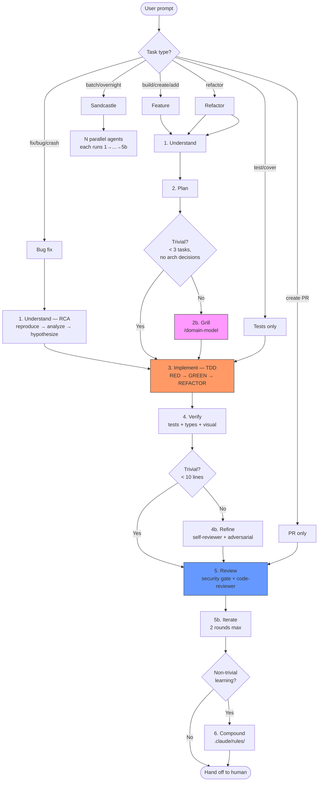
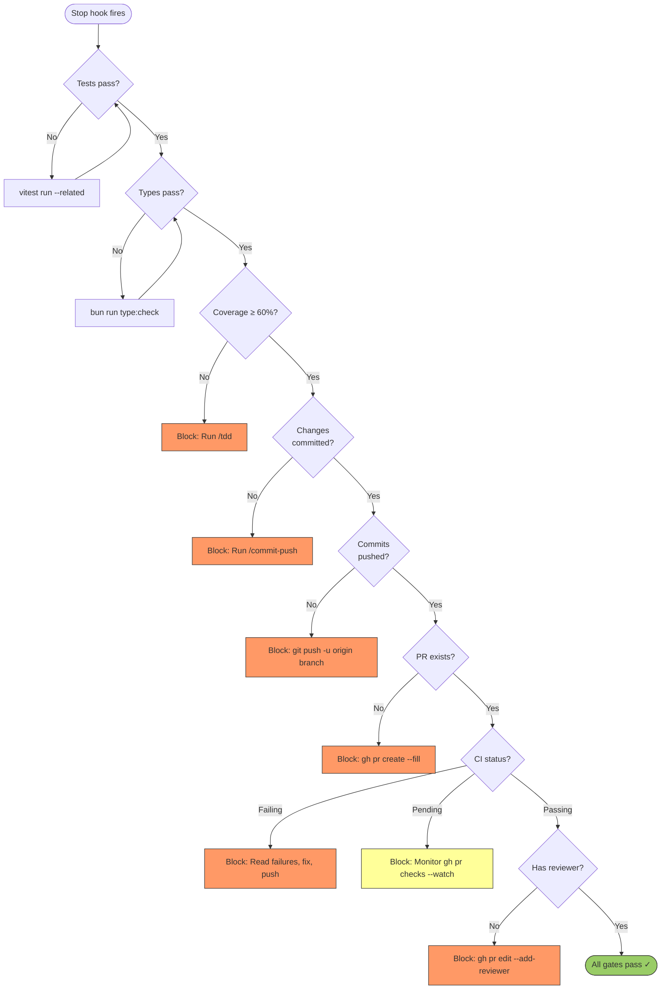

# Development Lifecycle Reference

## Phase Flowchart



## Phase 1: Understand

### New Feature
1. Read relevant code, docs, recent git history
2. Ask clarifying questions — one at time
3. Propose 2-3 approaches with trade-offs
4. UI work: generate HTML mockup → `agent-browser screenshot --annotate` → iterate
5. Challenge chosen approach (edge cases, failure modes)
6. Get user approval before proceeding

### Parallel Research Agents

Spawn background agents to:
- Investigate alternative libraries/patterns
- Scan codebase for prior art · conventions
- Surface edge cases · failure modes
- Check open issues · known gotchas in deps

Runs concurrently with user discussion — feeds into approach selection.

### Monitor Tool for Background Observation

**Monitor** streams long-running process output real-time. React immediately, never block.

- **CI**: `Monitor: gh pr checks <number> --watch`
- **Dev server**: `Monitor: bun run dev` — watch for ready/error
- **Test watcher**: `Monitor: vitest --watch` — react to red/green
- **Containers**: `Monitor: docker logs -f <container>`
- **Build**: `Monitor: bun run build`

Pattern: start Monitor, do other work, react when actionable.

### Refactor-First Gate

Before adding features to area with mixed patterns:
- [ ] Multiple patterns for same concern?
- [ ] Incomplete migration?
- [ ] Conflicting AI instructions needed?

If any true → refactor to single pattern first, separate PR. Mixed codebases produce lower-quality AI output.

### Bug Fix (4-Phase Root Cause Analysis)

**Iron law: no fixes without root cause investigation.**

1. **Reproduce** — read FULL error, write failing test
2. **Analyze** — find working examples, trace data flow upstream to origin
3. **Hypothesize** — "X is root cause because Y." Test ONE hypothesis at time.
4. **Fix at source** — fix where data originates, not where it crashes. Add defense-in-depth at entry point · business logic · env guards.

## Phase 2: Plan

### Scope Clarity

When scope ambiguous or requirements conflict:

1. **Surface assumptions:**
   ```
   ASSUMPTIONS:
   1. [assumption]
   2. [assumption]
   → Correct me now or I proceed with these.
   ```
2. **Stop on confusion.** Name conflict, present tradeoff, wait.
3. **Reframe to success criteria.** "Goal is [measurable outcome]. Correct?"
4. **Flag uncertainty.** `[CONFIDENCE: LOW — reason]`

### Naive-First Design

Start with dumbest solution that works. Justify every addition:

1. **Problem** — one paragraph. What and why now.
2. **Constraints** — hard boundaries (time, team, compat).
3. **Non-goals** — explicitly excluded.
4. **Simplest viable design** — most boring solution.
5. **Where naive falls short** — specific demonstrated gaps only.
6. **For each addition beyond naive** — what gap, what complexity, why simpler insufficient.

### Self-Adversarial Review

Before presenting plan, review:

| Dimension | Question |
|---|---|
| Simplicity | Fewer moving parts? "Why didn't you just..."? |
| Bundle/perf | Bundle size, render perf, initial load? |
| Accessibility | Keyboard nav, screen readers, WCAG? |
| Maintainability | Extendable in 6 months without author? |
| DX | API intuitive? Misuse risk? |
| Scope creep | Anything unsolicited? |
| Alternatives | One simpler rejected design and why. |

### Plan Checklist

- [ ] Every task: exact file paths, exact code, expected output
- [ ] No TBD, no "similar to Task N", no "add error handling"
- [ ] Bite-sized (2-5 min per task)
- [ ] Test step alongside every impl step
- [ ] Self-review: spec coverage, placeholder scan, type consistency

### Rapid Prototyping (UI/Interactive)

Replace upfront spec with competitive prototyping:

1. Define 2-3 constraint sets
2. Spawn one agent per set in parallel (`claude-sonnet-4-6`)
3. Each produces working prototype
4. Review all with user: `agent-browser screenshot` each
5. Select winner, write plan from chosen prototype

**When**: any feature where right approach unclear until running. Skip for pure logic/API/data-layer.

### Stacked PRs for Large Features

For plans with 5+ tasks:

1. Group tasks by logical boundary (data → logic → UI → tests)
2. Each group = one PR in stack
3. First PR targets base branch · subsequent target previous PR's branch
4. Review and merge bottom-up

Smaller PRs get 2-3x faster review with higher-quality feedback.

## Phase 2b: Grill

**Mandatory gate between planning and implementation.**

After plan written, auto-initiate `/domain-model`:

1. Present plan summary
2. Challenge against existing domain model (CONTEXT.md, ADRs)
3. Sharpen terminology — resolve ambiguous/overloaded terms
4. Challenge assumptions, surface trade-offs, find gaps
5. Resolve every decision branch
6. Update CONTEXT.md + create ADRs inline as decisions crystallize
7. Update plan with decisions changed
8. Get explicit confirmation: "Plan is solid, proceed"

### Why This Phase Exists

Code is byproduct of understanding. If user can't defend every decision under pressure → cognitive debt. Domain model grilling ensures human builds mental model *before* LLM writes code. Inline CONTEXT.md/ADR updates capture decisions as institutional memory.

### Skip Conditions

Grill mandatory unless ALL true:
- [ ] Bug fix with single identified root cause
- [ ] Plan has fewer than 3 tasks
- [ ] No architectural decisions

If skipping: "Grill skipped — trivial bug fix, no architectural decisions."

## Phase 3: Implement (TDD)

### Iron Law
**No production code without failing test first.**

### Cycle
1. RED — write one minimal failing test, verify it fails correctly
2. GREEN — write minimal code to pass
3. **TEST INTEGRITY CHECK** — verify test/assertion count hasn't decreased. If dropped → agent deleted/weakened tests. Reject, redo from RED.
4. REFACTOR — clean up while staying green

### Test Quality
- `userEvent.setup()` not `fireEvent`
- `getByRole` for accessibility assertions
- No `setTimeout`/`waitForTimeout` — use `await waitFor(() => expect(...))`
- Run `--detectAsyncLeaks` after

### Test Deletion Guard

AI agents sometimes delete/simplify tests to pass — "unpredictable genie" effect:

1. **Count check**: before GREEN, note `test()` blocks and `expect()` calls. After GREEN, verify counts equal or higher.
2. **Diff review**: test file deletions in GREEN step → flag for manual review.
3. **Pre-commit hook** (optional): reject commits reducing assertion count without `// intentional: [reason]`.

### Classification
| Suffix | Purpose |
|---|---|
| `.test.ts` | Unit — pure logic, no DOM |
| `.test.tsx` | Integration — renders components |
| `e2e/*.spec.ts` | E2E — Playwright browser |

## Phase 3b: Edge-Case Hardening (Optional)

After verification passes, dispatch agent for more tests:

1. Identify functions/components changed
2. Generate tests: boundary values · empty/null · concurrent access · error paths · large inputs
3. Run generated tests — keep passing, investigate failing
4. Add passing edge-case tests to suite

**When**: new public APIs, security-sensitive code, complex branching. Skip for trivial changes.

## Phase 4b: Refine (Self-Review Loop)

**Goal**: catch quality gaps · missing tests · simplification opportunities while context fresh.

### When to Run

- **Always** for features and bug fixes
- **Skip if**: trivial change (<10 lines, no logic) · pure test-only · docs-only

### Process

1. Dispatch `self-reviewer` on session diff
2. If diff >50 lines OR touches auth/security → also dispatch `adversarial-reviewer` in parallel
3. SubagentStop hook validates JSON output, writes to session dir
4. Process by priority:

| Priority | Action |
|----------|--------|
| P0 (blocks merge) | Fix immediately, re-run tests |
| P1 (should fix) | Fix, re-run tests |
| P2 `safe_auto` | Apply automatically |
| P2 `gated_auto` | Show to user, apply on confirmation |
| P2 `manual` | Report, let user decide |
| P3 / `advisory` | Skip — log for Phase 6 |

5. Commit fixes: `refactor(scope): self-review fixes`, re-verify
6. **Max 2 refinement rounds** — if P0/P1 persist, proceed to Review, flag them

### Structured Findings Format

Reviewers output JSON per `agents/findings-schema.md`:
- `severity`: P0-P3 | `autofix_class`: `safe_auto | gated_auto | manual | advisory`
- `pre_existing`: true if in dirty baseline (never blocks merge) | `confidence`: 0.0-1.0

### SubagentStart Context

Hook auto-injects: session-touched files · dirty baseline · branch/PR context · pointer to `agents/findings-schema.md`.

### SubagentStop Validation

Hook (matcher: `self-reviewer|code-reviewer|adversarial-reviewer`):
- Validates JSON matching findings schema · blocks/retries if malformed
- Writes to `/tmp/hook-session-$SESSION_ID/review-findings.json` · logs to `review-summary.log`

### Agents

| Agent | Focus | When |
|-------|-------|------|
| `self-reviewer` | Testing gaps · simplification · CI readiness | Always in 4b |
| `adversarial-reviewer` | Failure scenarios · boundary/race conditions | Diff >50 lines or auth/security |
| `code-reviewer` | Spec compliance · code quality (fresh-eyes) | Phase 5 |

## Phase 4: Review

### Security Gate

**Hard gate before PR creation.** AI-generated code statistically more likely to contain security issues.

Run SAST/SCA on changed files:
- [ ] No new critical/high findings
- [ ] No deps with known CVEs
- [ ] No `eval()` · `innerHTML` · `dangerouslySetInnerHTML` without sanitization
- [ ] No hardcoded secrets/tokens/API keys
- [ ] No SQL/command injection vectors

**Tooling**: `eslint-plugin-security` | `semgrep` | `bun audit` | `trivy fs .`

**Block PR creation** if new critical/high findings.

Dispatch `code-reviewer` for fresh-eyes review:

### Stage 1: Spec Compliance
- [ ] All requirements addressed | No scope creep | Breaking changes documented | Edge cases handled

### Stage 2: Code Quality (priority order)
1. **Security** — no eval · innerHTML · hardcoded secrets
2. **Type safety** — no `as any` · `@ts-ignore`
3. **Error handling** — async ops have error paths
4. **Accessibility** — keyboard nav · aria-labels · semantic HTML
5. **Testing** — tests verify behavior · edge cases covered
6. **DRY** — no duplicated logic
7. **Performance** — no unnecessary re-renders · heavy deps lazy-loaded

### Review Status Codes
- **APPROVED** — all checks pass | **CONCERNS** — minor, address then proceed | **NEEDS_CHANGES** — fix and re-review

### Cross-Model Review (Optional)
```
/codex:adversarial-review
```
Requires: `bun install -g @openai/codex` and OpenAI API key.
Install: `/plugin marketplace add openai/codex-plugin-cc` → `/plugin install codex@openai-codex` → `/codex:setup`

### Ship
```bash
gh pr create --title "type(scope): description" --body "..."
gh pr comment <URL> --body "@claude review"
```

## Phase 5b: Iterate

### Monitor CI Instead of Blocking

**Monitor** watches CI in background. Continue working, react immediately on fail/pass.

```
Monitor: gh pr checks <pr-number> --watch
```

**Round 1 — Initial review:**
1. Push + start monitoring. Continue other work.
2. CI green → dispatch `code-reviewer`.
3. `/resolve-pr-feedback` to triage · fix · reply · push.
4. Monitor CI again.

**Round 2 — Verification review:**
1. Dispatch `code-reviewer` (verifies Round 1 fixes).
2. `/resolve-pr-feedback` for remaining findings.
3. New issues → fix · push · monitor CI. No third review round.

**Hand off to human:**
1. Post final PR comment: changes · review findings · how addressed · test coverage.
2. Request review: `gh pr edit <number> --add-reviewer <username>`
3. **Stop.** Do not poll for human approval.

**If human requests changes later** (new session):
1. `/resolve-pr-feedback` — fetches · triages · fixes · replies · pushes
2. Monitor CI after push
3. One more `code-reviewer` round + `/resolve-pr-feedback`
4. Re-request human review, stop

**Exit conditions:**
- **Normal**: CI green + 2 automated reviews + human reviewer requested → stop
- **Re-entry**: human requests changes → new session, one review round, stop
- **Never**: poll for human approval or >2 review rounds per session

### Deploy Pipeline Monitoring (Post-Merge)

```
Monitor: gh run watch
```

Detect deploy failures immediately. If fails → diagnose, open follow-up PR.

## Lifecycle Stop Gates

`lifecycle-stop.sh` enforces cascade. Each gate blocks until satisfied.



## Hard Rules

- Never ask user to test manually. Use agent-browser · playwright · test runner.
- Never skip Phase 1.
- Never write production code without failing test first.

## Commit Discipline

**Commit when green.** One concern per commit. `type(scope): what changed` format.
Reference issues: `Closes #42` or `Fixes PROJ-123` in body.

## Phase 6: Compound

After non-trivial tasks, codify lessons as path-scoped rules:

```markdown
<!-- .claude/rules/protobuf-v2-timestamp.md -->
---
paths:
  - "**/*_pb*"
  - "**/gen/**"
---
Protobuf v2 Timestamp fields: use timestampFromDate() from @bufbuild/protobuf/wkt.
Never construct as { seconds, nanos } — causes JSON serialization failure.
```

Rules auto-load ONLY when Claude works on matching files.

**When to compound:**
- Bug fix revealing non-obvious pattern
- Migration gotcha that will recur
- API contract/convention team agreed on

**When NOT to compound:**
- One-off fix unlikely to recur
- Pattern already covered by hook
- Generic knowledge Claude already has

### Regression Evals for AI-Caused Bugs

When bug traced to AI-generated code:

1. **Classify failure**: category (wrong null handling · missed edge case · incorrect API usage · security gap)
2. **Create regression test**: catches failure class, not specific instance
3. **Add to CI**: runs every commit
4. **Track patterns**: same class recurs 3+ times → create `.claude/rules/` entry

Builds project-specific quality signal. Generic linting catches generic issues; regression evals catch *your project's* AI failure modes.

## Cross-Model Review

If `/codex:rescue` available → auto-dispatch plan for second opinion. Bug triage: use GitHub issue comments as cross-model channel.

## Subagents

| Agent | Role | When |
|---|---|---|
| `self-reviewer` | Testing gaps · simplification · CI readiness | Phase 4b |
| `adversarial-reviewer` | Failure scenarios · boundary/race conditions | Phase 4b (conditional) |
| `code-reviewer` | Fresh-eyes spec compliance + quality | Phase 5 |
| `verifier` | Tests + visual verification via browser | Phase 4 |

## Parallelization Guide

| Task | Parallelize? | How | Sweet spot |
|---|---|---|---|
| Codebase-wide migration | Yes | `/batch` | 5-30 agents per file/module |
| Security scan | Yes | `/batch` or Sandcastle | 3-5 agents per directory |
| Multiple UI designs | Yes | Spawn 3 agents, different constraints | 3 max |
| Independent features | Yes | Sandcastle (AFK) | 3-5 agents per issue |
| Test generation | Yes | Sandcastle or `/batch` | One per module |
| Bug fix | No | Sequential reasoning needed | 1 agent |
| Code review | 2 agents | spec+quality + Codex | 2-3 reviewers |

`/batch` for migrations · Sandcastle for AFK · 3 agents for design competition.

| Task complexity | Model |
|---|---|
| Simple (rename, move) | `claude-haiku-4-5` |
| Standard (feature) | `claude-sonnet-4-6` |
| Complex (architecture) | `claude-opus-4-7` |

Don't parallelize: bug fixes · hypothesis testing. Don't use >5 agents on overlapping files.
