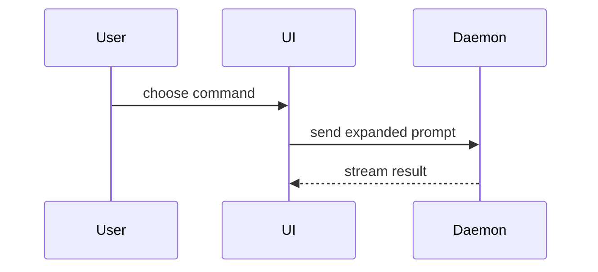

[Otwórz edytowalne źródło Excalidraw](/diagrams/skills/show-me.excalidraw)

Pomóż użytkownikowi zrozumieć wizualnie bieżący temat rozmowy. Pomiń wstęp i ogranicz opis do minimum. Wybierz najmniejszą wizualizację, która jasno przedstawia najważniejszą kwestię.
- Przedstaw logikę lub algorytm jako pseudokod:
```text
on(save)
  if content is unchanged
    return cached result
  write new content
  return fresh result
```
- Przedstaw przepływ sterowania w czasie działania jako drzewo wywołań:
```text
submitForm
  createSession
    persistPrompt
    launchAgent
  navigateToSession
```
- Przedstaw strukturę interfejsu jako drzewo komponentów, uwzględniając istotne granice stanu i modułów:
```tsx
<SessionPage> (apps/example/src/routes/session.tsx)
  useSessionEvents()
  <SessionToolbar>
    <RunSkillButton> (packages/ui)
```
- Przedstaw odpowiedzialność plików lub szeroki zakres refaktoryzacji jako płytkie drzewo plików:
```text
src/
├── commands/       # parses user actions
├── sessions/       # owns session state
└── transport/      # sends API requests
```
- Przedstaw interakcje komponentów, przepływ sterowania lub przepływ danych za pomocą Mermaid:

- Użyj `diff`, gdy najważniejsze jest to, co się zmienia, a otaczająca struktura już istnieje. Dopasuj formę różnic do tematu.
Dla zmiany komponentu:
```diff
 <SessionPage>
   useSessionEvents()
   <SessionToolbar>
+    <RunSkillButton />
   <SessionTimeline>
+    <SkillResultCard />
```
Dla zmiany układu plików:
```diff
 src/
 ├── commands/
+│   └── show-me.ts       # expands the slash command
 ├── sessions/
-└── transport.ts
+└── transport/
+    ├── client.ts
+    └── stream.ts
```
Dla zmiany drzewa wywołań lub stosu wywołań:
```diff
 submitForm
   createSession
     persistPrompt
+    expandSkillMention
     launchAgent
-  navigateToSession
+  navigateToSession
+    subscribeToEvents
```
Dla zmiany stanu lub przepływu sterowania:
```diff
 on(save)
-  write content
+  if content is unchanged
+    return cached result
+  write new content
+  invalidate cache
```
- Pokaż cały blok, gdy większość jest nowa, pominięty kontekst ukrywałby odpowiedzialność lub kolejność albo użytkownik potrzebuje docelowej struktury możliwej do skopiowania:
```ts
function expandSkill(command: string): string {
  const skillName = command.slice(1)
  return `use the ${skillName} skill`
}
```
- W przypadku wizualnego interfejsu, układu, porównania stanów lub koncepcji zbyt złożonej dla Mermaid utwórz jeden ukierunkowany plik HTML — diagram, infografikę lub krótki zestaw slajdów, zależnie od tego, co najlepiej pasuje. Dopasuj kolory, typografię, odstępy i komponenty produktu; użyj rzeczywistych etykiet i danych; zapewnij obsługę komputerów i urządzeń mobilnych. Następnie otwórz go dla użytkownika:
```
Bash(open path/to/show-me-{description}.html)
```
### wskazówki
Umieść każdą wizualizację obok krótkiego tekstu, który wspiera. Uwzględnij tylko wywołania, pliki, właściwości, stany i granice niezbędne do udzielenia odpowiedzi na bieżące pytanie użytkownika lub przedstawienia opcji rozwiązania omawianej kwestii.
Możesz użyć jednego z tych sposobów albo kilku; najprawdopodobniej nie użyjesz wszystkich. Kieruj się własnym osądem i nie przytłaczaj użytkownika.
