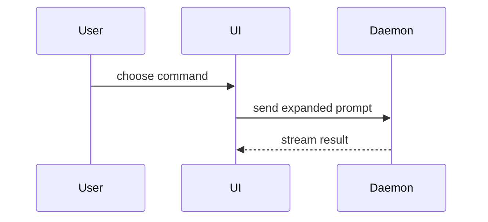

[開啟可編輯的 Excalidraw 原始檔](/diagrams/skills/show-me.excalidraw)

協助使用者以視覺方式理解目前的對話主題。省略開場白並保持文字精簡。選擇能清楚呈現重點的最小視圖。
- 以虛擬碼呈現邏輯或演算法：
```text
on(save)
  if content is unchanged
    return cached result
  write new content
  return fresh result
```
- 以呼叫樹呈現執行階段的控制流程：
```text
submitForm
  createSession
    persistPrompt
    launchAgent
  navigateToSession
```
- 以元件樹呈現 UI 結構，包括重要的狀態與模組邊界：
```tsx
<SessionPage> (apps/example/src/routes/session.tsx)
  useSessionEvents()
  <SessionToolbar>
    <RunSkillButton> (packages/ui)
```
- 以淺層檔案樹呈現檔案職責或大範圍重構：
```text
src/
├── commands/       # parses user actions
├── sessions/       # owns session state
└── transport/      # sends API requests
```
- 使用 Mermaid 呈現元件互動、控制流程或資料流：

- 當重點在於變更內容，且周邊結構已經存在時，使用 `diff`。讓差異內容的結構符合主題。
針對元件變更：
```diff
 <SessionPage>
   useSessionEvents()
   <SessionToolbar>
+    <RunSkillButton />
   <SessionTimeline>
+    <SkillResultCard />
```
針對檔案配置變更：
```diff
 src/
 ├── commands/
+│   └── show-me.ts       # expands the slash command
 ├── sessions/
-└── transport.ts
+└── transport/
+    ├── client.ts
+    └── stream.ts
```
針對呼叫樹或呼叫堆疊變更：
```diff
 submitForm
   createSession
     persistPrompt
+    expandSkillMention
     launchAgent
-  navigateToSession
+  navigateToSession
+    subscribeToEvents
```
針對狀態或控制流程變更：
```diff
 on(save)
-  write content
+  if content is unchanged
+    return cached result
+  write new content
+  invalidate cache
```
- 當大部分內容都是新的、略去脈絡會掩蓋權責歸屬或順序，或使用者需要可複製的目標結構時，呈現完整區塊：
```ts
function expandSkill(command: string): string {
  const skillName = command.slice(1)
  return `use the ${skillName} skill`
}
```
- 針對視覺化 UI、版面配置、狀態比較，或內容密集到不適合使用 Mermaid 的概念，撰寫一個聚焦的 HTML 檔案——依照最適合呈現重點的形式，製作圖表、資訊圖表或簡短投影片。配合產品的色彩、字體、間距與元件；使用真實的標籤與資料；同時支援桌面與行動裝置。接著為使用者開啟該檔案：
```
Bash(open path/to/show-me-{description}.html)
```
### 指引
將每個視覺內容放在其所支援的簡短文字旁。只保留回答使用者目前問題，或解決目前討論重點所需的呼叫、檔案、屬性、狀態與邊界。
你可以使用其中一種，也可以使用數種，但不太可能全部用上。請自行判斷，不要讓過多資訊造成使用者負擔。
