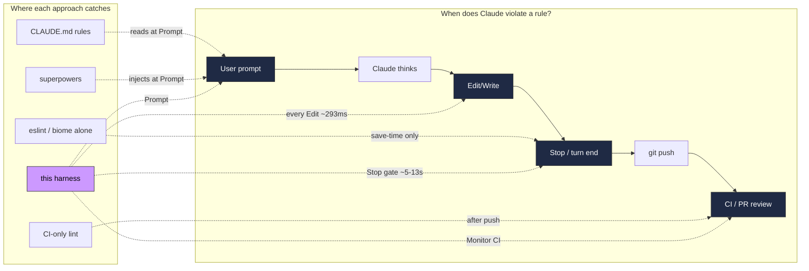

# FAQ

Questions, comparisons, and measurement methodology that back the claims in the [README](../README.md).

## Common questions

<details>
<summary><strong>Why not just write more CLAUDE.md rules?</strong></summary>

CLAUDE.md is read-every-turn context -- costs tokens AND is probabilistic. Claude reads "don't use `as any`" and still writes `as any` sometimes. Hooks are **post-write bash scripts** -- they fire 100% of the time, deterministic, zero LLM tokens. Rules in CLAUDE.md belong there when they're too nuanced for pattern matching (architecture, design judgment). Everything mechanically checkable belongs in a hook.
</details>

<details>
<summary><strong>Why not just use obra/superpowers?</strong></summary>

We do -- many lifecycle patterns (TDD red/green, grilling/domain-modeling, writing-for-agents) are inspired by or vendored from superpowers. The difference: superpowers teaches Claude what to do via prompts. We teach AND enforce. If Claude forgets the TDD rule mid-session, superpowers has no safety net. Our Stop hook refuses to end the turn until tests exist. Complementary, not competitive -- Pocock's own skills (to-questionnaire, to-spec, to-tickets) are listed under "Community Skills" for install.
</details>

<details>
<summary><strong>Why not just use eslint/biome?</strong></summary>

Biome (we ship it via frontend-starter-kit's biome reference) handles lint + format -- we don't replace that. What Biome can't do: catch patterns at Edit time (biome runs at save/CI), enforce workflow (plan -> grill -> TDD -> review), inject context (which rules apply to this file type), or block Stop until PR-ready. Hooks + Biome are layers, not alternatives. The biome reference adds 5 custom rules from the PR audit that live there because AST rules beat regex for those patterns.
</details>

<details>
<summary><strong>Why not a prompt-pack / "gstack" style system prompt?</strong></summary>

Prompt-packs = bundled system prompts or context-injection. They're probabilistic (LLM may or may not follow) and token-heavy (3-15k per prompt). Our prompt layer (intent-detect + user-prompt-context) is ~500-2k tokens and composable with hooks that catch what the prompt misses. Also: prompt-packs can't run bash, can't fail CI, can't verify output, can't spawn subagents. Different tool for different job.
</details>

<details>
<summary><strong>Is this Redpanda-specific?</strong></summary>

No. Redpanda-specific rules live behind the frontend-starter-kit `redpanda` profile -- registry workflow, Chakra bans, legacy imports, gated on `REDPANDA_KIT=1`. The core kit is stack-opinionated (React + TanStack + ConnectRPC) but org-agnostic. The public plugin has zero Redpanda internals.
</details>

<details>
<summary><strong>How do I customize or remove a hook?</strong></summary>

Every hook is a bash script in `.claude/hooks/` -- inspect, edit, delete. Plugin install places them in `~/.claude/plugins/cache/skills/frontend-skills/<ver>/.claude/hooks/`. Override per-project by copying to `<project>/.claude/hooks/` (takes precedence). Env vars control most behavior: `HOOK_VERBOSITY=terse`, `REACT_RULES_BAN_USEEFFECT=1`, `ORCHESTRATION_STRICT=0`, etc. See [Configuration](#configuration).
</details>

<details>
<summary><strong>What about Codex / OpenAI models?</strong></summary>

First-class. `codex-compat` skill generates `.codex/hooks.json` + consolidated Stop-phase batch checker + `AGENTS.md` (replaces Claude's PostCompact context re-injection). Hook scripts use `$(git rev-parse --show-toplevel)` path resolution so they work across both harnesses. `CLAUDE_SESSION_ID` / `CODEX_SESSION_ID` detected transparently.
</details>

<details>
<summary><strong>What's the overhead per session?</strong></summary>

PostToolUse hooks on a `.tsx` edit: **~293ms** wall-clock (hooks run concurrent, bottleneck = slowest). Non-JS/TS file: **~80ms** (bash spawn + extension check, all hooks exit immediately). Stop hook: **~5-13s** once per turn (Biome autofix + `tsc` + related tests + React diagnostics). PreToolUse on Bash: **~257ms**. For context: a typical Claude tool call is 3-8 seconds (network + inference), so PostToolUse is **3-8% overhead** -- imperceptible.
</details>

## Head-to-head: how does this compare?

| | Raw Claude Code | CLAUDE.md only | [obra/superpowers](https://github.com/obra/superpowers) | Prompt-pack / "gstack" | **this harness** |
|---|---|---|---|---|---|
| Enforcement model | None | Prompt (LLM reads rules) | Prompt (skills) | Prompt (system prompts) | **Hooks (deterministic) + skills** |
| Reliability | 0% | ~60% (Claude forgets) | ~70% (skips skill) | ~70% | **100% on hooks, ~90% on `paths:` skills** |
| LLM token overhead | 0 | ~2-8k / turn | ~500 / skill load | ~3-15k / prompt | **0 for hooks, ~500 for loaded skills** |
| Catches `as any` at write time | No | No | No | No | **Yes (~293ms)** |
| Catches missing tests at stop | No | No | No | No | **Yes (Stop gate blocks)** |
| Forces plan -> grill -> confirm | No | No | Partial (prompts) | No | **Yes (/development-lifecycle gates)** |
| Codex (OpenAI) support | N/A | N/A | No | N/A | **Yes (first-class, `codex-compat` skill)** |
| Cloud / scheduled mode | No | No | No | No | **Yes (Routines)** |
| Cross-session learning | No | Manual edit | No | No | **Yes (Phase 6 Compound -> `.claude/rules/`)** |
| Opinionated stack | N/A | N/A | Agnostic | Varies | **React + TanStack + ConnectRPC + Bun** |
| Config surface | 0 | Low | Low | Medium | **Medium (14 setup skills, env vars)** |
| Setup cost | 0 | ~30 min prompt writing | One `/install` | Varies | **3 commands** |

**TL;DR:** If your stack matches (React + Bun/TypeScript + modern patterns), the deterministic enforcement is worth the opinionation. If not, fork the hook scripts and keep the lifecycle skills.

## Where each approach intervenes

Most alternatives only touch one layer. Deterministic enforcement at every boundary is what closes the reliability gap.



## Real numbers (not marketing claims)

Hooks and rules derive from a 2026-04 audit of **~2,500 PRs / ~3,500 review comments across 4 repos (2022-2026)**. Every hook maps to a pattern that actually generated review churn.

| Metric | Source | Value |
|---|---|---|
| Review comments audited | Console, cloudv2, ui-registry, ai-gateway | **~3,500+** |
| PRs analyzed | Same | **~2,500+** |
| PostToolUse hooks shipped | Repo | **60** |
| React/TS/security checks | `react-rules-check.sh` + `tailwind-check.sh` | **34** |
| Biome rules added from audit | frontend-starter-kit `references/biome` | **5** |
| Tokens saved / session (typical) | Compressed messages + dedup + trimmed REFERENCEs | **~6,700** |
| Hook wall-clock on `.tsx` edit | Concurrent hooks, slowest wins | **~293ms** |
| Human review cycles per PR | Before / after enforcement | **3-5 -> 0-1** |
| Token waste per PR | Before / after | **~15-30k -> ~500-2k** |

See memory `project_pr_audit_hooks_2026_04` + `project_transcript_audit_2026_04` for the methodology.

## Token impact

| Without hooks/skills | With hooks+skills |
|---|---|
| `as any` -> ships -> human catches -> feedback loop (3000+ tokens) | Hook blocks -> 50 tokens -> fixed |
| No tests -> ships -> human requests -> another round (5000+ tokens) | Stop gate blocks -> 100 tokens -> tests added |
| Wrong import -> review -> fix (2000+ tokens) | Rules line prevents -> 0 extra tokens |
| **3-5 human review cycles per PR** | **0-1 human review cycles per PR** |
| **~15,000-30,000 tokens wasted on violations** | **~500-2,000 tokens in hook messages** |

## Performance

PostToolUse hooks run **concurrently** -- wall-clock time is slowest hook, not sum.

### Per Edit/Write (PostToolUse)

| Scenario | Wall-clock | What happens |
|----------|-----------|--------------|
| Edit `.go` / `.md` / `.css` file | **~80ms** | All hooks exit immediately on extension check |
| Edit `.tsx` file (clean code) | **~293ms** | Slowest hook (react-rules) runs full diff + 19 grep checks |
| Edit `package.json` | **~80ms** | Only bundle-guard runs, rest exit |

~80ms floor = bash process spawn + `jq` parse -- fixed cost regardless of hook count. More hooks don't increase wall-clock since run parallel.

### Per Bash command (PreToolUse)

| Hook | Time | Notes |
|------|------|-------|
| enforce-toolchain.sh | ~166ms | Grep chain on command string |
| conventional-commits-check.sh | ~91ms | Only does real work on `git commit -m` |
| **Total** | **~257ms** | Sequential, runs before every Bash call |

### Per turn (Stop)

| Hook | Time | Notes |
|------|------|-------|
| biome-autofix.sh | 1-3s | Only changed files, skips UI library dirs |
| typecheck-stop.sh | 2-5s | TypeScript 7 `tsc` (incremental) + related tests only |
| test-perf-stop.sh | 1-3s | Compare timings against session-start baseline |
| react-doctor-stop.sh | 1-2s | `--scope changed`, including untracked files |
| **Total** | **~5-13s** | Runs once when Claude finishes, not per edit |

### Token efficiency

Hook messages compressed (inspired by [Caveman](https://github.com/JuliusBrussee/caveman) + [arxiv:2604.00025](https://arxiv.org/abs/2604.00025)). LLM already know rules from SKILL.md -- hooks reminders, not tutorials.

| Optimization | Savings |
|---|---|
| Compressed systemMessage strings | ~40% fewer tokens per violation |
| Guidance deduplication (once per category per session) | ~50-70% fewer orchestration tokens |
| `HOOK_VERBOSITY=terse` (blocks only) | Suppress all warns |
| REFERENCE.md trimmed to essentials | -21% input tokens on skill loads |

### Context

Typical Claude Code tool call takes 3-8 seconds (network + LLM inference). PostToolUse overhead ~293ms = **3-8%** -- imperceptible. Stop hooks at 4-10s replace what'd run manually (lint, type check, tests) + only target changed/related files.

## LLM-optimized test reporters

In-house, zero-deps, Node + TypeScript. Ship as part of `shared/reporters/`. Scaffold into consumer repos via starter kit.

**Vitest:** `shared/reporters/vitest-llm-reporter.ts` -- silent-pass `ok N` trailer (~10 bytes); fail-case single-line JSON capped at `VITEST_LLM_MAX_FAILURES` (default 20). Wire:

```ts
import LlmReporter from './shared/reporters/vitest-llm-reporter';
export default defineConfig({ test: { reporters: [new LlmReporter()] } });
```

**Rstest:** no custom reporter needed. With `AI_AGENT=1`, Rstest selects its
built-in Markdown reporter; explicit verbose reporters are rewritten to
`--reporters=md` during agent runs.

**Playwright:** `shared/reporters/playwright-llm-reporter.ts` -- silent-pass `ok N` trailer with optional `skip`/`flaky` counts; fail-case single-line JSON capped at `PW_LLM_MAX_FAILURES` (default 15). Wire:

```ts
export default defineConfig({
  reporter: [['./shared/reporters/playwright-llm-reporter.ts']],
});
```

Both reporters follow same pattern: minimal-signal (not silent) on pass to defeat silent-glob-typo bugs, structured JSON on fail capped to prevent runaway output. Typical savings vs default reporters: 10-100x on stdout, which Claude reads back as tokens.

### Disabling browser MCPs

Figma + Chrome MCP servers = claude.ai account-level connectors, not project config. To disable (recommended for token savings if prefer subagent-browser patterns):

1. `/mcp` inside Claude Code to list currently connected servers
2. https://claude.ai/settings/connectors -- disconnect `Figma` + `Chrome Browser` if want free ~4KB of system-prompt instructions they consume per turn

## Further reading

Prior art, techniques, related work that informed design decisions in this harness:

### Test reporters (LLM-optimized)
- [vitest-llm-reporter (hansjm10)](https://github.com/hansjm10/vitest-llm-reporter) -- JSON schema + token-budget pattern inspiration
- [@zenai/playwright-coding-agent-reporter](https://github.com/getzenai/playwright-coding-agent-reporter) -- consolidated all-failures pattern (community, MIT)
- [Playwright Reporter API](https://playwright.dev/docs/api/class-reporter) -- official interface docs
- [Vitest Reporter interface](https://vitest.dev/advanced/reporters) -- official interface docs
- [Playwright Test Agents](https://playwright.dev/docs/test-agents) -- official AI ecosystem (Planner/Generator/Healer)
- [@playwright/mcp](https://www.npmjs.com/package/@playwright/mcp) -- official Playwright MCP server

### Token-efficient data formats
- [TOON (Token-Oriented Object Notation)](https://github.com/toon-format/toon) -- schema-aware JSON alternative for LLM prompts
- [CTON (Compact Token-Oriented Notation)](https://github.com/davidesantangelo/cton) -- JSON-compatible wire format

### Compression + caveman mode
- [Caveman plugin (JuliusBrussee)](https://github.com/JuliusBrussee/caveman) -- per-turn style reinforcement, multi-intensity modes
- [arxiv:2604.00025](https://arxiv.org/abs/2604.00025) -- prompt compression research

### State of the art
- [State of Playwright AI Ecosystem 2026](https://currents.dev/posts/state-of-playwright-ai-ecosystem-in-2026)
- [Agent Browser vs Puppeteer & Playwright (Webfuse)](https://www.webfuse.com/blog/agent-browser-vs-puppeteer-and-playwright)
