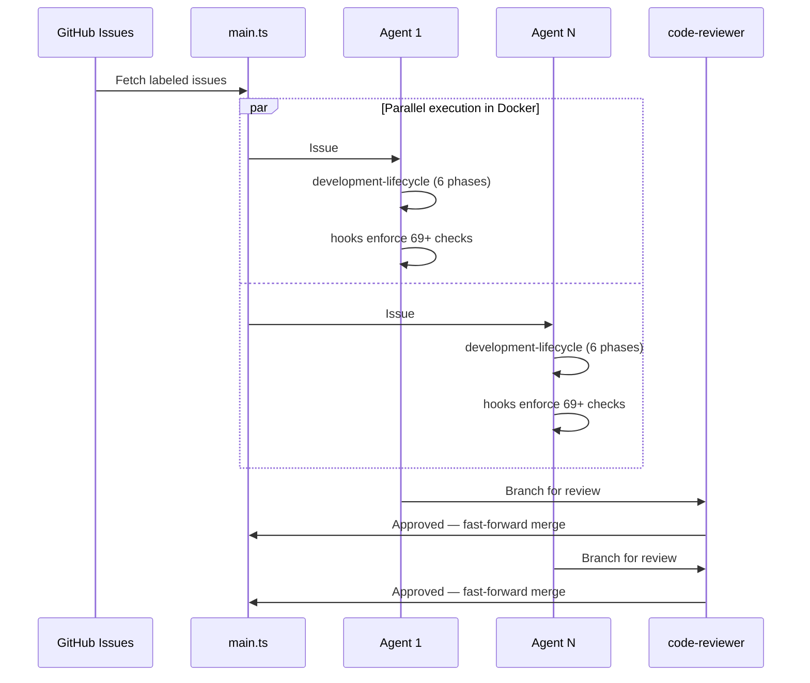

# Setup Sandcastle

[Sandcastle](https://github.com/mattpocock/sandcastle) runs agents in isolated Docker sandboxes with branch strategies. Each agent gets own branch, implements task via development-lifecycle, commits independently.

- Task picking: GitHub issues → one agent per issue
- Parallel: N agents in isolated sandboxes
- Quality: our hooks run inside each container
- Review: code-reviewer agent per branch
- Merge: fast-forward completed branches



## Steps

### 1. Install
```bash
bun add -D @ai-hero/sandcastle && bunx sandcastle init
```

### 2. Configure `.sandcastle/.env`
```
ANTHROPIC_API_KEY=sk-ant-...
```

### 3. Orchestration Script
See [REFERENCE.md](REFERENCE.md) for `main.ts` template (task picking, parallel agents, review pass).

### 4. Run
```bash
bunx tsx .sandcastle/main.ts
```

Each agent: reads issue → development-lifecycle → hooks enforce patterns → commits to branch → code-reviewer reviews → merge.

See [REFERENCE.md](REFERENCE.md) for templates and prompt patterns.
