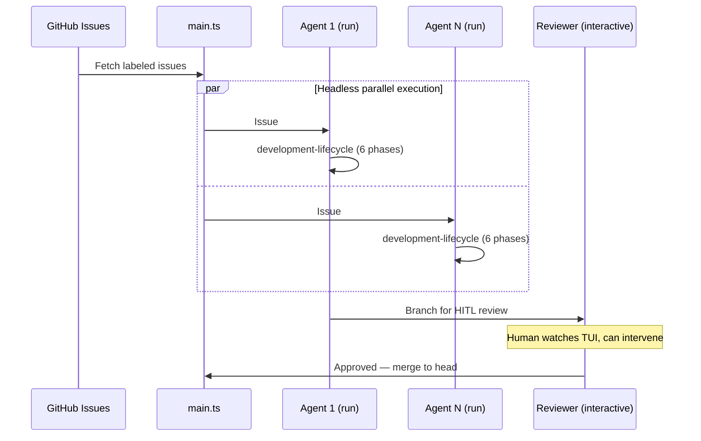

# Setup Sandcastle

[Sandcastle](https://github.com/mattpocock/sandcastle) orchestrates agents in sandboxes with branch strategies. Two launch modes:

- **`run()`** — headless (`--print`), stream-JSON parsed. For CI, batch, overnight.
- **`interactive()`** — full TUI passthrough (stdin/stdout/stderr). Human watches, can intervene. For HITL review, pair-review, local dev.

Both modes: our hooks fire inside each session. Development lifecycle enforced regardless of launch method.

**Capabilities:**
- Task picking: GitHub issues → one agent per issue
- Parallel: N agents in isolated sandboxes (`run()`)
- HITL review: interactive reviewer with full TUI (`interactive()`)
- `noSandbox()`: run without Docker — just git worktrees
- Quality: our hooks run inside each session
- Merge: branch strategies (head, merge-to-head, branch)



## Steps

### 1. Install
```bash
bun add -D @ai-hero/sandcastle && bunx sandcastle init
```

### 2. Configure `.sandcastle/.env`
```
ANTHROPIC_API_KEY=sk-ant-...
```

### 3. Choose launch mode

| Scenario | Mode | Sandbox |
|---|---|---|
| CI/batch/overnight | `run()` | `docker()` |
| Parallel 5+ issues | `run()` | `docker()` |
| Local dev → quick review | `interactive()` | `noSandbox()` |
| Pair-review with human watching | `interactive()` | `docker()` or `noSandbox()` |
| Single interactive session | `interactive()` | `noSandbox()` |

### 4. Orchestration Script
See [REFERENCE.md](REFERENCE.md) for templates: headless batch, HITL review, mixed pipelines.

### 5. Run
```bash
bunx tsx .sandcastle/main.ts
```

Each agent: reads issue → development-lifecycle → hooks enforce patterns → commits to branch → review → merge.

See [REFERENCE.md](REFERENCE.md) for templates and prompt patterns.
