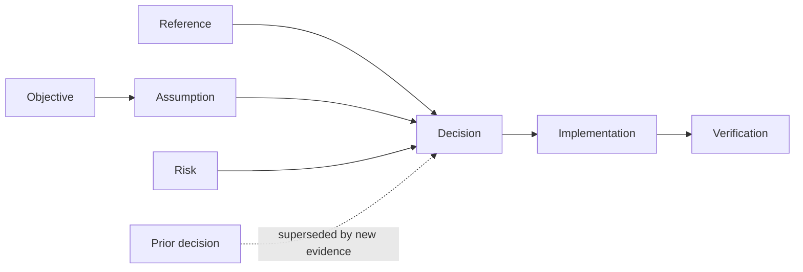

# Intent maps

An intent map makes consequential work understandable without replaying the agent's prose or
private reasoning. It is a presentation contract, not an extra artifact, workflow phase, or
approval gate.

## Trigger

Use one intent map when a substantial plan, analysis, review, recap, status, or handoff asks the
reader to understand causality, compare directions, or follow a change over time. Keep trivial,
single-path, or already-scannable output linear. A diagram that does not change a decision is
decoration; omit it.

The owning skill's safety rules, output schema, and ordering still win. Urgent findings, blockers,
and requested answers lead before the map.

## Graph vocabulary

- **Objective** -- the outcome in product or user language.
- **Assumption** -- a belief that could invalidate the direction.
- **Decision** -- the current choice, rejected alternative, and concise rationale.
- **Reference** -- the source that materially informed a claim or decision.
- **Implementation** -- the load-bearing file, symbol, API, schema, or focused diff.
- **Verification** -- the observed behavior, test, check, or metric that supports the result.
- **Risk** -- a credible unresolved failure or decision pressure.
- **Change** -- the evidence or constraint that superseded a prior decision.

Connect nodes with verbs: `motivates`, `constrains`, `informed`, `implemented by`, `verified by`,
or `supersedes`. Omit decorative relationships and exhaustive dependency edges.

## First read

Lead with the decision, result, or status, then show the map. The first read contains only the
objective, current decisions, active risks, and their shortest causal path. Prefer at most 9 visible
nodes and 120 words before drill-down; split by decision when the map exceeds that budget.

Progressively disclose:

1. assumptions and rejected alternatives;
2. exact references;
3. implementation files, symbols, and focused diff evidence;
4. verification receipts;
5. superseded decisions and their change triggers.

Raw diffs and long code excerpts are evidence behind an Implementation node, not the explanation's
primary structure. Link existing plans, issues, ADRs, commits, and reports instead of reproducing
them.

Summarize rationale as alternatives, choice, evidence, and change trigger. Never expose or invent
chain of thought, hidden deliberation, confidence scores, or private reasoning.

## Rendering ladder

Use the richest already-authorized surface: a native diagram or canvas block in a structured
artifact, Mermaid in Markdown, then short indented bullets when diagrams are unavailable. Do not
create a hosted plan, image, HTML report, or other side artifact only to satisfy this contract.

- **Plan/design:** map the proposed path from evidence to decision to verification.
- **Review/recap:** map actual changed behavior back to its decision and evidence; label inference.
- **Status/handoff:** map only the live frontier, blockers, next decision, and linked artifacts.

Keep one source graph through the lifecycle. A later recap updates or views the same intent; it does
not manufacture a parallel explanation.
